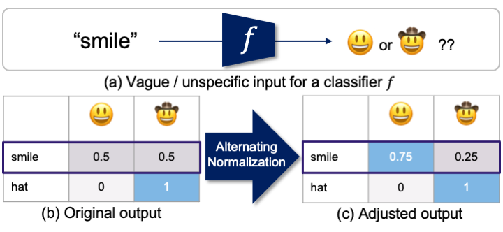

# When in Doubt: Improving Classification Performance with Alternating Normalization

<h4>
Findings of EMNLP 2021
<h4>

<h4>
  Menglin Jia, Austin Reiter, Ser-Nam Lim, Yoav Artzi and Claire Cardie
</br>
<span style="font-size: 14pt; color: #555555">
Cornell University, Facebook AI
</span>
</h4>
**arXiv**: https://arxiv.org/abs/2109.13449


<div align="center">
  
</div>


## Environment settings

This project is tested under Python 3.6, pytorch 1.5.0, torchvision 0.6.0

## Preparation

1. Download the data and put the data folder under <DATA_PATH>.
   - Simulation data: the randomly constructed arrays are available [here](https://cornell.box.com/s/4hvmsfj68ghq9lydekwtefk55p9d7y3v)  
   - DialogRE: [project page](https://github.com/nlpdata/dialogre)
   - Ultra-fine entity typing: [project page](https://www.cs.utexas.edu/~eunsol/html_pages/open_entity.html)
   - ImageNet: [project page](https://www.image-net.org/index.php)
2. For tuning process,  you need to check how many cpus you have first. This reporitory assumes the environment has at least 40 cpus.

## Simulation experiments

We have provided the randomly generately array produced from step 1 in the `data` folder.

```bash
# step 1. generate random matrices
python experiments_simulation.py --step 1 \
    --data-root <DATA_PATH>
# step 2. get results
python experiments_simulation.py --step 2 \
    --data-root <DATA_PATH>
```

## Empirical experiments

### Ultra-fine entity typing

```bash
# Denoise
python experiments_text.py \
    --dataset ultrafine_entity_typing \
    --data-root=<DATA_PATH> --model-type denoise

# multitask
python experiments_text.py \
    --dataset ultrafine_entity_typing --data-root=<DATA_PATH>
```

###  Relation extraction

```bash
python experiments_text.py \
    --dataset dialogue_re --data-root=<DATA_PATH>
```

### ImageNet

```bash
python experiments_visual.py --dataset imagenet --data-root=<DATA_PATH>
```


## License

This repo are released under the CC-BY-NC 4.0 license. See [LICENSE](https://github.com/KMnP/vise/blob/master/LICENSE) for additional details.